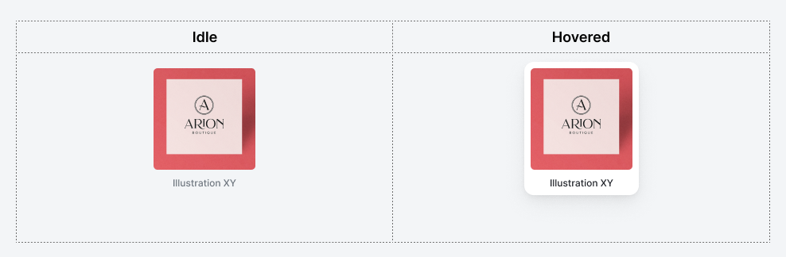

# Welcome to Kittl's full stack assignment!

Consider checking these links before starting the assignment:

- [Storybook Documentation](https://storybook.js.org/docs/basics/introduction/)
- [Storybook Guides](https://www.learnstorybook.com/)

## Assignment

The assignment consists of four parts:

### 1. Server: Review the provided code and fix everything you think is bad with it.

You might have a strong urge to just rewrite the whole project, but **that's not the point of this assignment**.
Please try to keep the original structure and don't refactor code unless absolutely necessary.
The main point is to see how good you are at working with and reviewing the existing(and not the best) codebase.
Try to provide granular changes (e.g. commits) with comments and explanations on what and why you changed.
If you think that there is something that requires fixing and will take multiple hours of work to fix it - just write about the issue and how you would approach fixing it.

#### Evaluation

Part 1 will be evaluated on the following criteria:

- Number of fixed, commented and missed issues in the provided server codebase.

### 2. Server: Is this code production ready? How can we make it production ready?

Although this code seems to work, we already have some issues with it. For example in our "production" deployment we have thousands of illustrations and it takes forever to get the response. Can you do something about it?

#### Evaluation

Part 2 will be evaluated on the following criteria:

- The solution proposed reduces performance issues on the `/illustrations` endpoint.

### 3. Client: Implement a `Card` component and a set of Storybook stories that reflect its different possible states.



Consider taking a look at our [Figma](https://figma.com) [design file](.resources/assignment.fig) to be able to inspect the component styles carefully.

> You'll need to download the design file and open it in figma, see [this help page](https://help.figma.com/hc/en-us/articles/360041003114-Import-files-into-Figma#Drag_and_Drop_Files) for more info.

#### Resources

- [Design File](.resources/assignment.fig)
- [Inter Font](https://fonts.google.com/specimen/Inter) <br/>

#### Evaluation

Part 3 will be evaluated on the following criteria:

- Card matches the provided design (colors, sizes, etc.)
- Main states can be viewed/tested in Storybook

### 4. Client: Fetch and show the illustrations from the API on the `Dashboard` component.

In the last step we want to see the API connected with the client. You can use the placeholder `Dashboard` component for that.

#### Evaluation

Part 4 will be evaluated on the following criteria:

- Dashboard fetches and renders the illustrations from the API.

## General requirements & final solution

- The assignment should be completed in TypeScript & React.
- Please work on a separate branch and [submit a Pull Request](https://docs.github.com/en/pull-requests/collaborating-with-pull-requests/proposing-changes-to-your-work-with-pull-requests/creating-a-pull-request) for review.
- Ensure that Storybook builds sucessfully and `chromatic` build step doesn't fail.
- Add any extra information(comments, future improvement ideas, deployment plan, etc.) to the description of the pull request.

## Scripts

In the project directory, you can run:

```bash
yarn
```

or

```bash
npm i
```

to install dependencies, (you'll need [yarn](https://yarnpkg.com/) installed). Feel free to use `npm` instead of `yarn` if you wish.

- `yarn dev:client` or `npm dev:client` - Will run Storybook on your computer. Open [http://localhost:6006](http://localhost:6006) to view it in the browser. The page will reload if you make edits.
- `yarn dev:server` or `npm dev:server` - Will run the server on your computer. The server will restart if you make edits.
- `yarn db:populate` or `npm db:populate` - Recreates the database with fake data (useful for testing)
